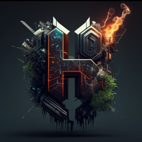

# Portfolio Personnel

## À Propos de Moi

Développeur web passionné, je crée des solutions numériques innovantes qui combinent technologie et créativité.

## Technologies Principales

- Next.js
- React
- TypeScript
- Three.js
- Tailwind CSS

## Projets Clés

### 🎬 Lakika - Plateforme de Streaming

**Technologie:** Next.js, React

- Plateforme de streaming vidéo moderne
- Interface utilisateur intuitive
- Système de recommandation personnalisé

### 🏢 Orinoco - Réseau Social d'Entreprise

**Technologie:** React, Node.js

- Solution collaborative interne
- Communication d'équipe sécurisée
- Gestion de projets intégrée

### 📄 TkeBot - Assistant IA d'Analyse PDF

**Technologie:** Intelligence Artificielle, Python

- Analyse de documents PDF avancée
- Extraction intelligente d'informations
- Rapport détaillé généré automatiquement

<!-- ## Contact

- Email: [votre.email@exemple.com]
- LinkedIn: [Votre Profil LinkedIn]
- GitHub: [Votre Profil GitHub] -->

## Compétences

- Développement Web Full-Stack
- Design Responsive
- Intégration d'IA
- Gestion de Projet
- Optimisation Performance

## Portfolio Généré Avec

- Next.js 15
- React 19
- JavaScript
- Tailwind CSS
- Three.js
- React Three Fiber
- React Vertical Timeline Component
